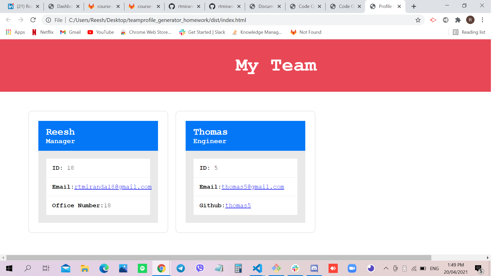

# Team Profile Generator

## Site Picture


## Technologies Used
- Javascript - adds special effects on pages
- Node.js - an open source server environment that uses JavaScript on the server
- GitBash - for cloning repository and pushing code to GitHub
- GitHub - holds repository that deploys to GitHub Pages

## Summary
This file contains a generated index.html  for the Team Profile. It also contains code that was created using Javascript and Node.js. 

## Code Snippet
```html
const writeUp = (data) => {
    console.log(data);
    let employees_list = getEmployees(data);
const fullHTML = ` 
<!DOCTYPE html>
<html lang="en">
<head>
    <meta charset="UTF-8">
    <meta http-equiv="X-UA-Compatible" content="IE=edge">
    <meta name="viewport" content="width=device-width, initial-scale=1.0">
    <title>Profile Generator</title>
    <link rel="stylesheet" href="css/style.css" />
</head>
<body>
    <div id="wrapper">
        <div id="header">
            My Team
        </div>
        <div id="listBoxes">
            ${employees_list}
        </div>
    </div>
</body>
</html>`;

function writePage() {
fs.writeFile("dist/index.html", fullHTML, err => {
        if (err) {
            console.log(err);
        } else {
            console.log("Generating index.html...");
        }
    });
}}
```

```html
<html>

</html>
```
## Video Link
https://drive.google.com/file/d/1Tse29wdvTPrqfdxifOglogqGoLkWqr9_/view?usp=sharing

## Author Links 
[LinkedIn](https://www.linkedin.com/in/rosario-miranda-b81170132/)<br />
[GitHub](https://github.com/rtmiranda18)
